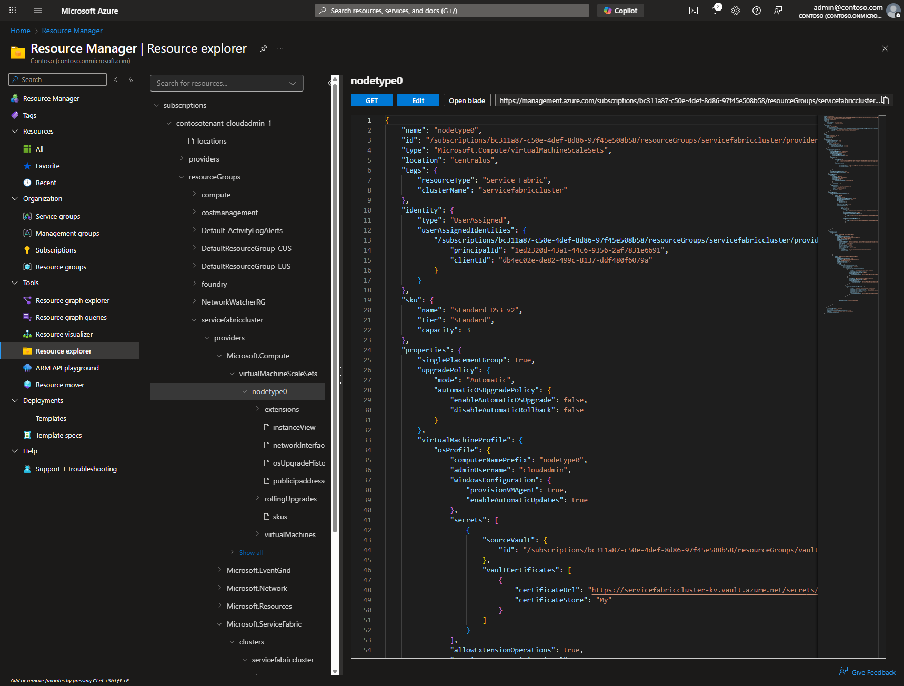
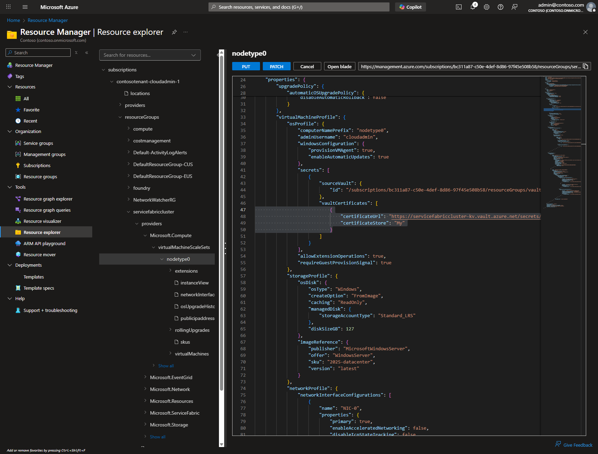
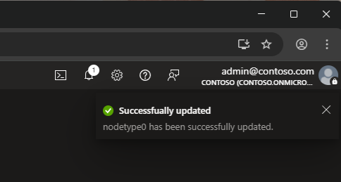
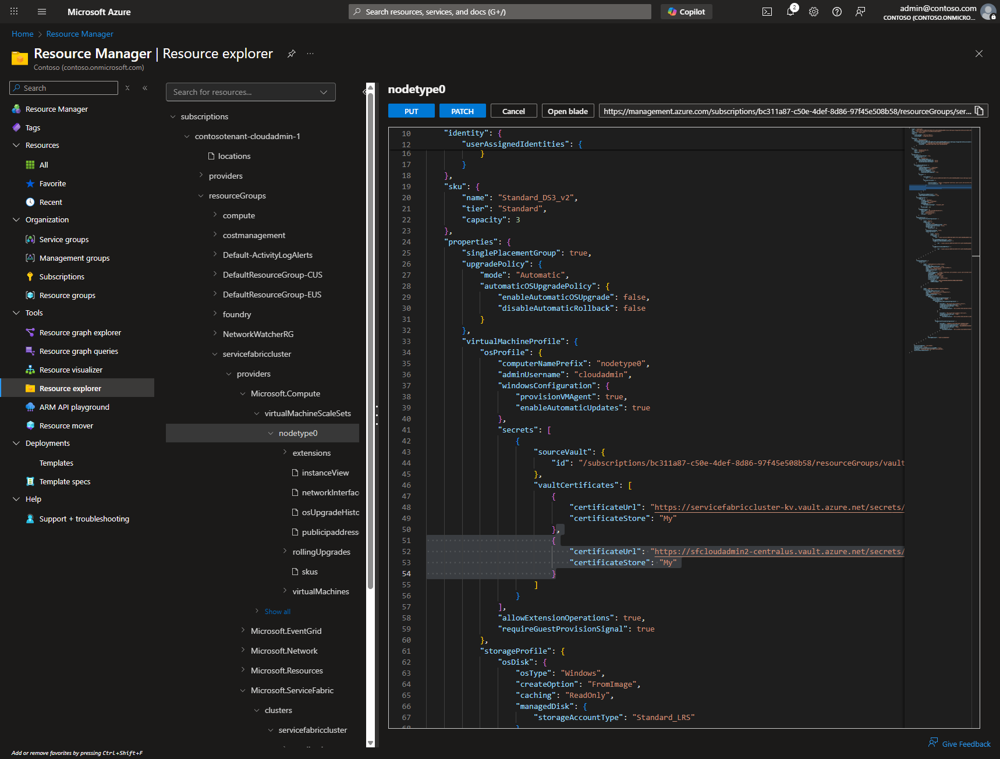
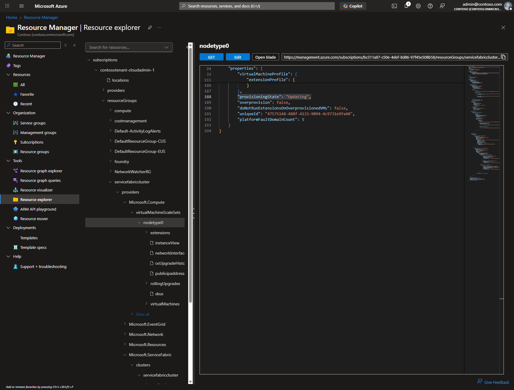
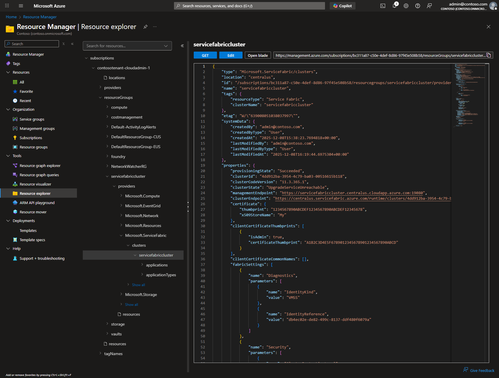
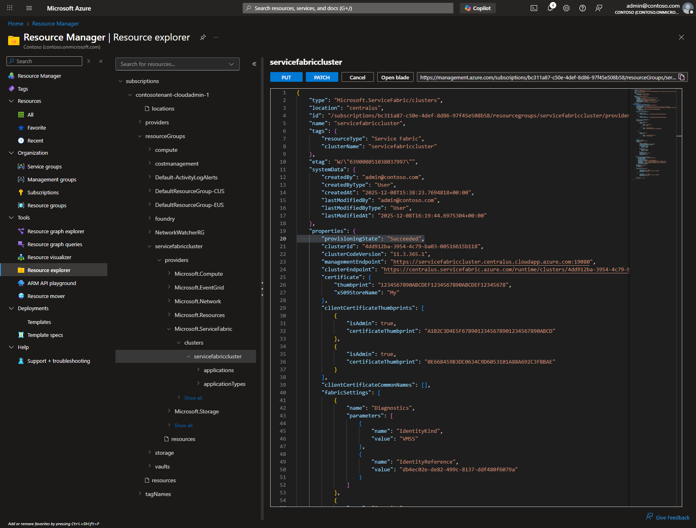

## Applies To: Azure clusters secured with x509 Thumbprint.  If you are trying to rollover a Common Name cert please refer to [this article](https://docs.microsoft.com/en-us/azure/service-fabric/service-fabric-cluster-rollover-cert-cn)

## How to add and swap the Secondary Certificate using Azure Portal

Steps to add a secondary certificate to an existing Service Fabric cluster are located in [Add or remove certificates for a Service Fabric cluster in Azure](https://docs.microsoft.com/en-us/azure/service-fabric/service-fabric-cluster-security-update-certs-azure#add-a-secondary-certificate-and-swap-it-to-be-the-primary-using-resource-manager-powershell). Adding a secondary cluster certificate cannot currently be performed in the Azure portal. You have to use Azure PowerShell for that.

Another option is to use the Azure Portal's Resource Explorer with interactive GET, EDIT, PUT, and PATCH buttons. See [Managing Azure Resources](../Deployment/managing-azure-resources.md) for detailed information about using Resource Explorer.

## Steps

### Azure Portal

#### 1. Create a new certificate and Upload to Key Vault. There are multiple methods to do this depending on intent and configuration, some are listed below. Choose one of the below that meets configuration and security requirements:

> a. Create with any reputable CA
> b. Generate self-signed certs using Azure Portal -> Key Vault.
> c. Create and upload using PowerShell - [CreateKeyVaultAndCertificateForServiceFabric.ps1](../Scripts/CreateKeyVaultAndCertificateForServiceFabric.ps1)

### Azure Portal - Virtual Machine Scale Set

#### 2. Using Resource Explorer, navigate to the Virtual Machine Scale Set configured for the cluster to view the current configuration:

1. In the Azure Portal, select the **Resource Explorer** from the left navigation menu or search for "Resource Explorer".
2. Navigate to the Virtual Machine Scale Set resource:

   ```
   subscriptions
   └───%subscription name%
       └───ResourceGroups
           └───%resource group name%
               └───Resources
                   └───Microsoft.Compute
                       └───virtualMachineScaleSets
                           └───%virtual machine scale set name%
   ```

   For detailed instructions on using Resource Explorer, see [Managing Azure Resources](../Deployment/managing-azure-resources.md).

3. Click the **GET** button to retrieve the current VMSS configuration.

   

4. Review the current configuration, specifically the `virtualMachineProfile / osProfile / secrets` section.

#### 3. Using Resource Explorer, modify the Virtual Machine Scale Set configuration to add the secondary certificate

1. After reviewing the configuration from the GET request in step 2, click the **EDIT** button to enable editing mode.

2. Make the necessary modifications to add the secondary certificate (see step 4 below for the specific changes needed).

#### 4. Modify **"virtualMachineProfile / osProfile / secrets"** to add (deploy) the new certificate to each of the nodes in the node type. Choose one of the following options

> a. If the new certificate is in the **same Key Vault** as the Primary, add **"certificateUrl"** and **"certificateStore"** to existing array of **"vaultCertificates"** as shown below:

```json
  "virtualMachineProfile": {
    "osProfile": {
    …
      "secrets": [
        {
          "sourceVault": {
            "id": "/subscriptions/xxxxxxxx-xxxx-xxxx-xxxx-xxxxxxxxxxxx/resourceGroups/sampleVaultGroup/providers/Microsoft.KeyVault/vaults/samplevault"
        },
        "vaultCertificates": [
          {
            "certificateUrl": "https://samplevault.vault.azure.net/secrets/clustercert001/d5eeaf025c7d435f81e7420393b442a9",
            "certificateStore": "My"
          },
          {
            "certificateUrl": "https://samplevault.vault.azure.net/secrets/clustercert002/77ff7688258a41f7b0afdd890eb4aa8c",
            "certificateStore": "My"
          }
        ]
      }
    ]
```

> b. If the new certificate is in a **different Key Vault** as the Primary, add an additional secret to the array of **"secrets"** with **"sourceVault"** and **"vaultCertificates"** configuration as shown below:

```json
  "virtualMachineProfile": {
    "osProfile": {
    …
    "secrets": [
      {
        "sourceVault": {
          "id": "/subscriptions/xxxxxxxx-xxxx-xxxx-xxxx-xxxxxxxxxxxx/resourceGroups/sampleVaultGroup/providers/Microsoft.KeyVault/vaults/samplevault"
        },
        "vaultCertificates": [
          {
            "certificateUrl": "https://samplevault.vault.azure.net/secrets/clustercert001/d5eeaf025c7d435f81e7420393b442a9",
            "certificateStore": "My"
          }
        ]
      },
      {
        "sourceVault": {
          "id": "/subscriptions/xxxxxxxx-xxxx-xxxx-xxxx-xxxxxxxxxxxx/resourceGroups/sampleVaultGroup/providers/Microsoft.KeyVault/vaults/samplevault2"
        },
        "vaultCertificates": [
          {
            "certificateUrl": "https://samplevault2.vault.azure.net/secrets/clustercert002/77ff7688258a41f7b0afdd890eb4aa8c",
            "certificateStore": "My"
          }
        ]
      }
    ]
```

#### 5. Add **"certificateSecondary"** configuration in **"virtualMachineProfile / extensionProfile / extensions / settings"**

```json
"virtualMachineProfile": {
  "osProfile": {
    ...
    "extensionProfile": {
      "extensions": [
        {
          "properties": {
            "autoUpgradeMinorVersion": true,
            "settings": {
                "clusterEndpoint": "https://westus.servicefabric.azure.com/runtime/clusters/d4556f3b-e496-4a46-9f20-3db88fecdf11",
                "nodeTypeRef": "WordCount",
                ...
                "certificate": {
                  "thumbprint": "16A2561C8C691B9C683DB1CA06842E7FA85F6726",
                  "x509StoreName": "My"
                },
                "certificateSecondary": {
                  "thumbprint": "8934E0494979684F2627EE382B5AD84A8FAD6823",
                  "x509StoreName": "My"
                }
            },
            "publisher": "Microsoft.Azure.ServiceFabric",
            "type": "ServiceFabricNode",
            "typeHandlerVersion": "1.0"
            },
            "name": "wordcount_ServiceFabricNode"
        },
```

#### 6. Execute PATCH to update the Virtual Machine Scale Set

1. After making the modifications in EDIT mode, click the **PATCH** button to submit the changes.

   

2. On success, a notification will appear and the response body will show the updated configuration.

   

   

#### 7. **Wait** for the Virtual Machine Scale Set update to complete

1. Click the **GET** button to retrieve the latest VMSS state.
2. Scroll through the response to find the `provisioningState` property.
3. If `provisioningState` equals `Updating`, wait a few minutes and click GET again.

   

4. Continue checking until the `provisioningState` shows `Succeeded`.

#### 8. **Perform steps 2 - 7 for each node type (Virtual Machine Scale Set)**

### Azure Portal - Service Fabric Cluster

#### 9. Using Resource Explorer, navigate to the Service Fabric cluster to view the current configuration

1. In the [Resource Explorer](https://portal.azure.com/#view/Microsoft_Azure_Resources/ResourceManagerBlade/~/resourceexplorer), navigate to the Service Fabric cluster resource:

   ```
   subscriptions
   └───%subscription name%
       └───ResourceGroups
           └───%resource group name%
               └───Resources
                   └───Microsoft.ServiceFabric
                       └───%cluster name%
   ```

   For detailed instructions on using Resource Explorer, see [Managing Azure Resources](../Deployment/managing-azure-resources.md).

2. Click the **GET** button to retrieve the current cluster configuration.

   

3. Review the current certificate configuration in the `properties / certificate` section.

#### 10. Using Resource Explorer, modify the Service Fabric cluster configuration to add the secondary certificate thumbprint

1. After reviewing the configuration from the GET request in step 9, click the **EDIT** button to enable editing mode.
2. Make the necessary modifications to add the secondary certificate thumbprint (see step 11 below for the specific changes needed).

#### 11. Modify **"properties / certificate / thumbprintSecondary"** to add the new certificate configuration to the cluster

**Note**: If **"thumbprintSecondary"** is not currently configured, you'll need to add this property with the thumbprint value of your new certificate.

```json
{
  "certificate": {
    "thumbprint": "16A2561C8C691B9C683DB1CA06842E7FA85F6726",
    "x509StoreName": "My",
    "thumbprintSecondary": "(String)"
  },
```

```json
  "type": "Microsoft.ServiceFabric/clusters",
    ...
  "properties": {
    "provisioningState": "Succeeded",
    "clusterId": "d4556f3b-e496-4a46-9f20-3db88fecdf11",
    "clusterCodeVersion": "6.3.162.9494",
    "clusterState": "Ready",
    "managementEndpoint": "https://hughsftest.westus.cloudapp.azure.com:19080",
    "clusterEndpoint": "https://westus.servicefabric.azure.com/runtime/clusters/d4556f3b-e496-4a46-9f20-3db88fecdf11",
    "certificate": {
      "thumbprint": "16A2561C8C691B9C683DB1CA06842E7FA85F6726",
      "thumbprintSecondary": "8934E0494979684F2627EE382B5AD84A8FAD6823",
      "x509StoreName": "My"
    },
```

#### 12. Execute PUT to update the Service Fabric cluster configuration

1. After making the modifications in EDIT mode, click the **PUT** button to submit the complete updated configuration.

   

2. **Important**: Currently, on a successful PUT request, **no response is shown** in the output area. This is a known quirk of Resource Explorer.

**Note**: This step typically takes a while, up to an hour. See FAQ: [Why do cluster upgrades take so long](../Cluster/Why%20do%20cluster%20upgrades%20take%20so%20long.md)

#### 13. **Wait** for the Service Fabric cluster update to complete

1. Click the **GET** button to retrieve the latest cluster state.
2. Scroll through the response to find the `provisioningState` property - it should show `Succeeded` when complete.

   

3. If `provisioningState` equals `Updating`, wait a few minutes and click GET again to requery the cluster.

### Azure Portal - Virtual Machine Scale Set Certificate Swap

#### 14. Using Resource Explorer, swap the certificate values in the Virtual Machine Scale Set

1. Navigate to the Virtual Machine Scale Set resource in Resource Explorer.
2. Click the **GET** button to retrieve the current configuration.
3. Click the **EDIT** button to enable editing mode.

#### 15. Swap the values of "certificate" and "certificateSecondary" properties in the Virtual Machine Scale Set resource

```json
"virtualMachineProfile": {
      "osProfile": {
        ...
        "extensionProfile": {
            "extensions": [
            {
                "properties": {
                "autoUpgradeMinorVersion": true,
                "settings": {
                    ... swap thumbprints in the two certificate properties below
                    "certificate": {
                        "thumbprint": "8934E0494979684F2627EE382B5AD84A8FAD6823",
                        "x509StoreName": "My"
                    },
                    "certificateSecondary": {
                        "thumbprint": "16A2561C8C691B9C683DB1CA06842E7FA85F6726",
                        "x509StoreName": "My"
                    }
                },
                "publisher": "Microsoft.Azure.ServiceFabric",
                "type": "ServiceFabricNode",
                "typeHandlerVersion": "1.0"
                },
            "name": "wordcount_ServiceFabricNode"
        },
```

#### 16. Execute PATCH to update the Virtual Machine Scale Set with swapped certificates

1. After swapping the certificate thumbprints in EDIT mode, click the **PATCH** button to submit the changes.
2. On success, a notification will appear confirming the operation.

#### 17. **Wait** for the Virtual Machine Scale Set certificate swap to complete

1. Click the **GET** button to retrieve the latest VMSS state.
2. Check the `provisioningState` field in the response - it should show `Succeeded`.
3. If `provisioningState` equals `Updating`, wait a few minutes and click GET again to requery the scale set.

#### 18. Perform steps 14 - 17 for each node type (Virtual Machine Scale Set)

### Azure Portal - Service Fabric Cluster Certificate Swap

#### 19. Using Resource Explorer, swap the certificate values in the Service Fabric cluster

1. Navigate to the Service Fabric cluster resource in Resource Explorer.
2. Click the **GET** button to retrieve the current configuration.
3. Click the **EDIT** button to enable editing mode.

#### 20. Swap the "certificate" values in "thumbprint" and "thumbprintSecondary" for the Service Fabric Cluster resource

```json
  "type": "Microsoft.ServiceFabric/clusters",
    ...
  "properties": {
    "provisioningState": "Succeeded",
    "clusterId": "d4556f3b-e496-4a46-9f20-3db88fecdf11",
    "clusterCodeVersion": "6.3.162.9494",
    "clusterState": "Ready",
    "managementEndpoint": "https://hughsftest.westus.cloudapp.azure.com:19080",
    "clusterEndpoint": "https://westus.servicefabric.azure.com/runtime/clusters/d4556f3b-e496-4a46-9f20-3db88fecdf11",
    "certificate": {
      "thumbprint": "8934E0494979684F2627EE382B5AD84A8FAD6823",
      "thumbprintSecondary": "16A2561C8C691B9C683DB1CA06842E7FA85F6726",
      "x509StoreName": "My"
    },
```

#### 21. Execute PUT to update the Service Fabric cluster with swapped certificates

1. After swapping the certificate thumbprints in EDIT mode, click the **PUT** button to submit the complete updated configuration.
2. **Important**: Currently, on a successful PUT request, **no response is shown** in the output area. This is a known quirk of Resource Explorer.

**Note**: This step typically takes a while, up to an hour.

#### 22. **Wait** for the Service Fabric cluster certificate swap to complete

1. Click the **GET** button to retrieve the latest cluster state.
2. Check the `provisioningState` field in the response - it should show `Succeeded`.
3. If `provisioningState` equals `Updating`, wait a few minutes and click GET again to requery the cluster.

### Azure Portal

#### 23. When the cluster updates are complete, verify the certificate thumbprints have swapped by checking from Service Fabric Explorer -> Cluster -> Manifest


* Or in the Azure portal > Cluster -> Security


### NOTE: Best practice is to use same sequence of steps above to remove secondary certificate configuration when certificate is expired or no longer needed

## Troubleshooting

### Errors while performing operations in Resource Explorer

#### To troubleshoot errors while modifying a resource configuration

1. Review the error message displayed in the Resource Explorer response area.
2. Common issues include:

   * Invalid JSON syntax
   * Missing required fields in the configuration
   * Certificate URL or Key Vault reference errors
   * Incorrect thumbprint values

3. Verify the JSON configuration is valid and complete before executing PUT or PATCH.
4. Check that all certificate URLs and Key Vault references are correct and accessible.

For additional guidance, see [Managing Azure Resources](../Deployment/managing-azure-resources.md).

### Alternative: Using ARM API Playground

For advanced scenarios requiring multiple tabs or flexible API version management, you can use [ARM API Playground](https://portal.azure.com/#view/Microsoft_Azure_Resources/ResourceManagerBlade/~/armapiplayground) as an alternative. See [Managing Azure Resources](../Deployment/managing-azure-resources.md) for detailed instructions.
