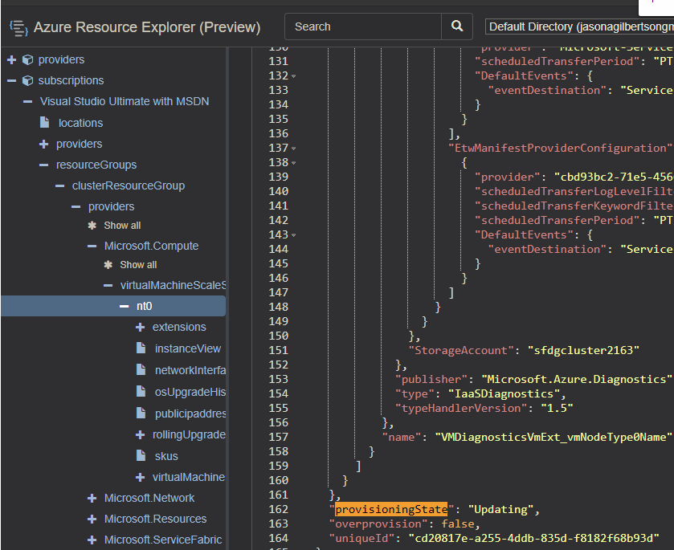
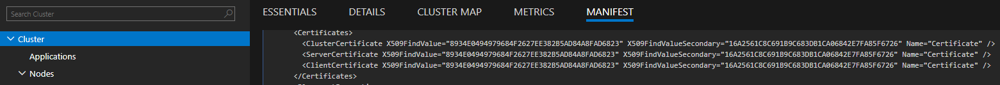
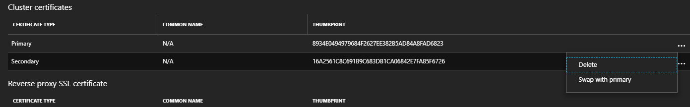
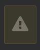
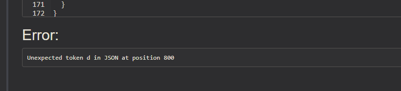

## Use [https://resources.azure.com](https://resources.azure.com) to add and swap the Secondary Certificate

Steps to add a secondary certificate to an existing Service Fabric cluster are located in [Add or remove certificates for a Service Fabric cluster in Azure](https://docs.microsoft.com/en-us/azure/service-fabric/service-fabric-cluster-security-update-certs-azure#add-a-secondary-certificate-and-swap-it-to-be-the-primary-using-resource-manager-powershell). Adding a secondary cluster certificate cannot currently be performed in the Azure portal. You have to use Azure powershell for that.

Another option is to use the [Azure Resource Explorer](https://resources.azure.com)

## Steps

### Azure Portal

#### 1. Create a new certificate and Upload to Key Vault. There are multiple methods to do this depending on intent and configuration, some are listed below. Choose one of the below that meets configuration and security requirements:

  > a. Create with any reputable CA  
  > b. Generate self-signed certs using Azure Portal -> Key Vault.  
  > c. Create and upload using PowerShell - [CreateKeyVaultAndCertificateForServiceFabric.ps1](../Scripts/CreateKeyVaultAndCertificateForServiceFabric.ps1)

### Azure Resource Explorer virtual machine scale set

#### 2. In <https://resources.azure.com>, navigate to the virtual machine scale set configured for the cluster:

```
    subscriptions
    └───%subscription name%
        └───resourceGroups
            └───%resource group name%
                └───providers
                    └───Microsoft.Compute
                        └───virtualMachineScaleSets
                            └───%virtual machine scale set name%
```


#### 3. Click "Read/Write" permission and "Edit" to edit configuration.

  


#### 4. Modify **"virtualMachineProfile / osProfile / secrets"**, to add (deploy) the new certificate to each of the nodes in the nodetype. Choose one of the options below:

> a. If the new certificate is in the **same Key Vault** as the Primary, add **"certificateUrl"** and **"certificate"** store to existing array of **"vaultCertificates"** as shown below:

```json
  "virtualMachineProfile": {
    "osProfile": {
    …
      "secrets": [
        {
          "sourceVault": {
            "id": "/subscriptions/xxxxxxxx-xxxx-xxxx-xxxx-xxxxxxxxxxxx/resourceGroups/sampleVaultGroup/providers/Microsoft.KeyVault/vaults/samplevault"
        },
        "vaultCertificates": [
          {
            "certificateUrl": "https://samplevault.vault.azure.net/secrets/clustercert001/d5eeaf025c7d435f81e7420393b442a9",
            "certificateStore": "My"
          },
          {
            "certificateUrl": "https://samplevault.vault.azure.net/secrets/clustercert002/77ff7688258a41f7b0afdd890eb4aa8c",
            "certificateStore": "My"
          }
        ]
      }
    ]
```

> b. If the new certificate is in a **different Key Vault** as the Primary, add an additional secret to the array of **"secrets"** with **"sourceVault"** and **"vaultCertificates"** configuration as shown below:

```json
  "virtualMachineProfile": {
    "osProfile": {
    …
    "secrets": [
      {
        "sourceVault": {
          "id": "/subscriptions/xxxxxxxx-xxxx-xxxx-xxxx-xxxxxxxxxxxx/resourceGroups/sampleVaultGroup/providers/Microsoft.KeyVault/vaults/samplevault"
        },
        "vaultCertificates": [
          {
            "certificateUrl": "https://samplevault.vault.azure.net/secrets/clustercert001/d5eeaf025c7d435f81e7420393b442a9",
            "certificateStore": "My"
          }
        ]
      },
      {
        "sourceVault": {
          "id": "/subscriptions/xxxxxxxx-xxxx-xxxx-xxxx-xxxxxxxxxxxx/resourceGroups/sampleVaultGroup/providers/Microsoft.KeyVault/vaults/samplevault2"
        },
        "vaultCertificates": [
          {
            "certificateUrl": "https://samplevault2.vault.azure.net/secrets/clustercert002/77ff7688258a41f7b0afdd890eb4aa8c",
            "certificateStore": "My"
          }
        ]
      }
    ]
```

#### 5. Add **\"certificateSecondary\"** configuration in **"virtualMachineProfile / extensionProfile / extensions / settings"**:

```json
"virtualMachineProfile": {
  "osProfile": {
    ...
    "extensionProfile": {
      "extensions": [
        {
          "properties": {
            "autoUpgradeMinorVersion": true,
            "settings": {
                "clusterEndpoint": "https://westus.servicefabric.azure.com/runtime/clusters/d4556f3b-e496-4a46-9f20-3db88fecdf11",
                "nodeTypeRef": "WordCount",
                ...
                "certificate": {
                  "thumbprint": "16A2561C8C691B9C683DB1CA06842E7FA85F6726",
                  "x509StoreName": "My"
                },
                "certificateSecondary": {
                  "thumbprint": "8934E0494979684F2627EE382B5AD84A8FAD6823",
                  "x509StoreName": "My"
                }
            },
            "publisher": "Microsoft.Azure.ServiceFabric",
            "type": "ServiceFabricNode",
            "typeHandlerVersion": "1.0"
            },
            "name": "wordcount_ServiceFabricNode"
        },
```

#### 6. At top of page, click PUT.


#### 7. **Wait** for the virtual machine scale set Updating the secondary certificate to complete. At the top of page, click GET to check status. Verify "provisioningState" shows "Succeeded". If "provisioningState" equals "Updating", continue to periodically click GET at top of page to requery scale set.




#### 8. **Perform steps 2 - 7 for each nodetype (virtual machine scale set)**

### Azure Resource Explorer service fabric cluster

#### 9. In <https://resources.azure.com>, navigate to the service fabric cluster:

```
    subscriptions
    └───%subscription name%
        └───resourceGroups
            └───%resource group name%
                └───providers
                    └───Microsoft.ServiceFabric
                        └───clusters
                            └───%cluster name%
```


#### 10. Click "Read/Write" permission and "Edit" to edit configuration.

  


#### 11. Modify **"properties / certificate / thumbprintSecondary"**, to add (deploy) the new certificate configuration to each of the nodes in the cluster.

#### Note: in the 'Edit' view, if **"thumbprintSecondary"** is not configured, a template placeholder will be the editor with value of "(String)". Replace "(String)" with thumbprint value.

```json
{
  "certificate": {
    "thumbprint": "16A2561C8C691B9C683DB1CA06842E7FA85F6726",
    "x509StoreName": "My",
    "thumbprintSecondary": "(String)"
  },
```

```json
  "type": "Microsoft.ServiceFabric/clusters",
    ...
  "properties": {
    "provisioningState": "Succeeded",
    "clusterId": "d4556f3b-e496-4a46-9f20-3db88fecdf11",
    "clusterCodeVersion": "6.3.162.9494",
    "clusterState": "Ready",
    "managementEndpoint": "https://hughsftest.westus.cloudapp.azure.com:19080",
    "clusterEndpoint": "https://westus.servicefabric.azure.com/runtime/clusters/d4556f3b-e496-4a46-9f20-3db88fecdf11",
    "certificate": {
      "thumbprint": "16A2561C8C691B9C683DB1CA06842E7FA85F6726",
      "thumbprintSecondary": "8934E0494979684F2627EE382B5AD84A8FAD6823",
      "x509StoreName": "My"
    },
```

#### 12. At top of page, click PUT. This step typically **does** take a while up to an hour.

* FAQ: [Why do cluster upgrades take so long](../Cluster/Why%20do%20cluster%20upgrades%20take%20so%20long.md)


#### 13. **Wait** for the SF cluster Updating the secondary certificate to complete. At the top of page, click GET to check status. Verify "provisioningState" shows "Succeeded". If "provisioningState" equals "Updating", continue to periodically click GET at top of page to requery cluster.


### Azure Resource Explorer virtual machine scale set

#### 14. In <https://resources.azure.com>, navigate to the virtual machine scale set configured for the cluster:

```
    subscriptions
    └───%subscription name%
        └───resourceGroups
            └───%resource group name%
                └───providers
                    └───Microsoft.Compute
                        └───virtualMachineScaleSets
                            └───%virtual machine scale set name%
```

#### 15. Swap the values of "certificate" and "certificateSecondary" properties in the Virtual Machine scale set resource

```json
"virtualMachineProfile": {
      "osProfile": {
        ...
        "extensionProfile": {
            "extensions": [
            {
                "properties": {
                "autoUpgradeMinorVersion": true,
                "settings": {
                    ... swap thumbprints in the two certificate properties below
                    "certificate": {
                        "thumbprint": "8934E0494979684F2627EE382B5AD84A8FAD6823",
                        "x509StoreName": "My"
                    },
                    "certificateSecondary": {
                        "thumbprint": "16A2561C8C691B9C683DB1CA06842E7FA85F6726",
                        "x509StoreName": "My"
                    }
                },
                "publisher": "Microsoft.Azure.ServiceFabric",
                "type": "ServiceFabricNode",
                "typeHandlerVersion": "1.0"
                },
                "name": "wordcount_ServiceFabricNode"
            },
```

#### 16. Click PUT and Wait for the update to complete. 


#### 17. **Wait** for the scale set Updating the primary and secondary certificate swap to complete. At the top of page, click GET to check status. Verify "provisioningState" shows "Succeeded". If "provisioningState" equals "Updating", continue to periodically click GET at top of page to requery scale set.


#### 18. Perform steps 14 - 17 for each nodetype (virtual machine scale set)

### Azure Resource Explorer service fabric cluster

#### 19. In <https://resources.azure.com>, navigate to the service fabric cluster:

```
    subscriptions
    └───%subscription name%
        └───resourceGroups
            └───%resource group name%
                └───providers
                    └───Microsoft.ServiceFabric
                        └───clusters
                            └───%cluster name%
```

#### 20. Swap the "certificate" values in "thumbprint" and "thumbprintSecondary" for the ServiceFabric Cluster resource

```json
  "type": "Microsoft.ServiceFabric/clusters",
    ...
  "properties": {
    "provisioningState": "Succeeded",
    "clusterId": "d4556f3b-e496-4a46-9f20-3db88fecdf11",
    "clusterCodeVersion": "6.3.162.9494",
    "clusterState": "Ready",
    "managementEndpoint": "https://hughsftest.westus.cloudapp.azure.com:19080",
    "clusterEndpoint": "https://westus.servicefabric.azure.com/runtime/clusters/d4556f3b-e496-4a46-9f20-3db88fecdf11",
    "certificate": {
      "thumbprint": "8934E0494979684F2627EE382B5AD84A8FAD6823",
      "thumbprintSecondary": "16A2561C8C691B9C683DB1CA06842E7FA85F6726",
      "x509StoreName": "My"
    },
```

#### 21. Click PUT and Wait for the update to complete. This step typically **does** take a while up to an hour.


#### 22. **Wait** for the SF cluster Updating the primary and secondary certificate swap to complete. At the top of page, click GET to check status. Verify "provisioningState" shows "Succeeded". If "provisioningState" equals "Updating", continue to periodically click GET at top of page to requery cluster.


### Azure Portal

#### 23. When the cluster updates are complete, verify the certificate thumbprints have swapped by checking from Service Fabric Explorer -> Cluster -> Manifest



* Or in the Azure portal > Cluster -> Security 



### NOTE: Best practice is to use same sequence of steps above to remove secondary certificate configuration when certificate is expired or no longer needed.

## Troubleshooting

### Exclamation / warning error in resources.azure.com while performing "PUT" or "PATCH".

#### To troubleshoot errors while modifying a resource configuration, for example, an exclamation or warning icon is temporarily displayed, scroll to the bottom of the page and review the error:


