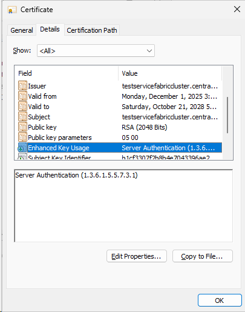

# Service Fabric Certificate Client Authentication EKU Removal Impact

## Problem Description

Public certificate authorities (Microsoft, DigiCert) are removing the Client Authentication EKU (OID: 1.3.6.1.5.5.7.3.2) from public TLS certificates. While Service Fabric's server-side validation doesn't require this EKU, **browsers will not display certificates without it** in certificate selection dialogs, blocking access to Service Fabric Explorer web UI.

**Primary Impact:**

- **Browser-based SFX access**: Users cannot select client certificates in browsers
- **MITS clusters**: Managed Identity authentication failures (HTTP 403)

**What Still Works:**

- PowerShell, SDK, REST APIs, CLI tools
- Service Fabric Explorer standalone application
- Node-to-node communication
- Core cluster operations

### Timeline

- **Microsoft certificate services**: September 15 - November 9, 2025
- **DigiCert**: Started October 1, 2025; ends May 1, 2026
- **Impact**: Begins immediately upon certificate renewal

### Why This Is Happening

Public CAs are standardizing TLS certificates to include only Server Authentication EKU. Client Authentication EKU is being reserved for private PKI use cases requiring mutual TLS.

**Industry Context:**

- **CA/Browser Forum** and **Chrome Root Program** policies drive this standardization
- Public CAs align with [RFC 5280](https://datatracker.ietf.org/doc/html/rfc5280) guidance: EKU restricts certificate use to specific purposes
- **RFC 5280 Note:** Absence of EKU extension means "no restrictions" - certificate is valid for all purposes. However, modern browsers and frameworks enforce EKU validation for security, so missing Client Authentication EKU blocks client certificate selection
- Private PKI remains free to issue certificates with both EKUs for internal mutual TLS scenarios

## Symptoms

### MITS Failures (MITS-enabled clusters only)

**What is MITS?** Managed Identity Token Service enables applications on Service Fabric to authenticate to Azure services using managed identities. MITS uses **mutual TLS (mTLS)** with the cluster certificate to communicate with Service Fabric management endpoints.

**Why Client Authentication EKU is Required:**

- MITS client presents the cluster certificate as a **client certificate** during TLS handshake
- Service Fabric management endpoint validates the certificate must have Client Authentication EKU (1.3.6.1.5.5.7.3.2) for mTLS
- Without this EKU, the server rejects the client certificate, resulting in HTTP 403

**Error:**

```json
ManagedIdentityCredential authentication failed: Service request failed.
Status: 500 (Internal Server Error)
Content: {"StatusCode":403,"ReasonPhrase":"Client certificate required"}
```

### Browser Certificate Selection

**Issue:** Browsers will not display certificates that only have Server Authentication EKU when accessing Service Fabric Explorer at `https://<yourcluster>.<region>.cloudapp.azure.com:19080`.

**Why This Happens:**

When a web browser connects to a Service Fabric cluster endpoint (`https://<yourcluster>.<region>.cloudapp.azure.com:19080`), the server requests client certificate authentication. The browser filters available certificates based on the **Client Authentication EKU** (1.3.6.1.5.5.7.3.2). Certificates with only Server Authentication EKU (1.3.6.1.5.5.7.3.1) are not considered valid client certificates by the browser and are **excluded from the certificate selection dialog**.

**Platform-Specific Behavior:**

- **Edge/Chrome (Windows):** Uses Windows Schannel - strictly filters by Client Authentication EKU
- **Firefox:** Uses NSS (Network Security Services) - may have different filtering behavior but typically requires Client Authentication EKU
- **.NET/HttpClient:** May reject certificates missing Client Authentication EKU for client certificate authentication
- **PowerShell/Azure CLI:** Work correctly - use certificate store directly, not browser filtering

**Result:** The browser certificate selection dialog appears empty or does not show your cluster certificate, preventing SFX web access even though the certificate exists in your certificate store.

**Workaround:** Use [Service Fabric Explorer desktop application](service-fabric-explorer-desktop-app.md) which does not filter certificates by Client Authentication EKU.

**Note:** Node-to-node communication and core cluster operations are unaffected.

## Verify Certificate EKU

1. **Download certificate from Azure Key Vault** (CER format)
2. **Open certificate** → Details tab → Enhanced Key Usage
3. **Verify both EKUs present:**

   - Server Authentication (1.3.6.1.5.5.7.3.1)
   - Client Authentication (1.3.6.1.5.5.7.3.2)

   

**PowerShell check:**

```powershell
$cert = Get-Item Cert:\LocalMachine\My\<thumbprint>
$cert.EnhancedKeyUsageList
```

## Mitigation

### Preferred Solution: Cluster Certificates with Both EKUs

The recommended approach is to continue using cluster certificates that include both Server Authentication and Client Authentication EKUs:

1. **Request new cluster certificate with both EKUs** from your CA:

   - Server Authentication (1.3.6.1.5.5.7.3.1)
   - Client Authentication (1.3.6.1.5.5.7.3.2)
2. **Upload to Azure Key Vault**
3. **Deploy certificate:**

   - **Common Name**: Deploy via Key Vault VM extension; Service Fabric auto-detects
   - **Thumbprint**: Follow [certificate rollover process](https://learn.microsoft.com/en-us/azure/service-fabric/service-fabric-cluster-security-update-certs-azure)

### Alternative: Use Separate Client Certificates for SFX

If cluster certificates cannot include Client Authentication EKU, configure separate client certificates for browser-based SFX access:

1. **Issue client certificates** with both Server Authentication and Client Authentication EKUs

   - Request from your certificate authority (CA)
   - Ensure both EKUs are present:
     - Server Authentication (1.3.6.1.5.5.7.3.1)
     - Client Authentication (1.3.6.1.5.5.7.3.2)
2. **Upload client certificates to Azure Key Vault**

   - Note the certificate thumbprints
   - Store as secrets or certificates
3. **Add client certificates to Service Fabric cluster configuration:**

   **PowerShell - Add admin client certificate:**

   ```powershell
   # Add admin client certificate by thumbprint
   Add-AzServiceFabricClientCertificate `
       -ResourceGroupName "<resourceGroupName>" `
       -Name "<clusterName>" `
       -Thumbprint "<client-cert-thumbprint>" `
       -Admin
   ```

   **PowerShell - Add read-only client certificate:**

   ```powershell
   # Add read-only client certificate by thumbprint
   Add-AzServiceFabricClientCertificate `
       -ResourceGroupName "<resourceGroupName>" `
       -Name "<clusterName>" `
       -Thumbprint "<client-cert-thumbprint>"
   ```

   **PowerShell - Add multiple client certificates:**

   ```powershell
   # Add multiple admin and read-only certificates
   Add-AzServiceFabricClientCertificate `
       -ResourceGroupName "<resourceGroupName>" `
       -Name "<clusterName>" `
       -AdminClientThumbprint "<admin-cert-thumbprint-1>", "<admin-cert-thumbprint-2>" `
       -ReadonlyClientThumbprint "<readonly-cert-thumbprint-1>"
   ```

   **PowerShell - Using common name (recommended):**

   ```powershell
   # Add admin client certificate by common name
   Add-AzServiceFabricClientCertificate `
       -ResourceGroupName "<resourceGroupName>" `
       -Name "<clusterName>" `
       -CommonName "<certificate-common-name>" `
       -IssuerThumbprint "<issuer-thumbprint>" `
       -Admin
   ```

   **Azure Portal - Add client certificates:**

   1. Navigate to your Service Fabric cluster in [Azure Portal](https://portal.azure.com)
   2. Under **Settings**, select **Security**
   3. In the **Client certificates** section, click **+ Add**
   4. Choose certificate type:
      - **Admin client** - Full cluster management access
      - **Read-only client** - Query and read-only access
   5. Enter certificate details:
      - **Authorization by:** Select "Thumbprint" or "Subject common name"
      - **Thumbprint or common name:** Enter the certificate thumbprint (64 hex characters) or CN
      - **Issuer thumbprint:** (For common name only) Enter issuer thumbprint for validation
   6. Click **Add** to save
   7. Wait for cluster update to complete (may take several minutes)

   **Azure Portal - View existing client certificates:**

   1. Navigate to cluster → **Settings** → **Security**
   2. Scroll to **Client certificates** section
   3. View configured admin and read-only client certificates
   4. Remove certificates using the **Delete** (trash can) icon if needed

   **Documentation:**

   - [Add-AzServiceFabricClientCertificate cmdlet reference](https://learn.microsoft.com/en-us/powershell/module/az.servicefabric/add-azservicefabricclientcertificate)
   - [Manage client access using certificates](https://learn.microsoft.com/en-us/azure/service-fabric/service-fabric-cluster-security#client-to-node-certificate-based-security)

   **Verify client certificates:**

   ```powershell
   # Get cluster configuration
   $cluster = Get-AzServiceFabricCluster -ResourceGroupName "<resourceGroupName>" -Name "<clusterName>"
   
   # View client certificate thumbprints
   $cluster.ClientCertificateThumbprints
   
   # View client certificate common names
   $cluster.ClientCertificateCommonNames
   ```

4. **Install client certificates on user machines:**

   - Deploy PFX to users who need SFX access
   - Install to `Cert:\CurrentUser\My` (Personal store)
   - Browsers will now display these certificates for SFX authentication
5. **Test SFX access:**

   - Navigate to `https://<yourcluster>.<region>.cloudapp.azure.com:19080`
   - Browser should display the new client certificate in selection dialog
   - Select certificate to authenticate and access SFX

**Result:** Browser-based SFX works with separate client certificates while cluster certificates only have Server Authentication EKU.

**Documentation:**

- [Manage client access using certificates](https://learn.microsoft.com/en-us/azure/service-fabric/service-fabric-cluster-security#client-to-node-certificate-based-security)
- [Add or remove certificates for a Service Fabric cluster](https://learn.microsoft.com/en-us/azure/service-fabric/service-fabric-cluster-security-update-certs-azure)

### MITS Clusters: No Workaround Available

**Critical:** MITS (Managed Identity Token Service) requires the cluster certificate to have both Server Authentication and Client Authentication EKUs. There is no workaround - MITS will fail without Client Authentication EKU in the cluster certificate.

### Last Resort: Service Fabric Explorer Desktop Application

If browser-based SFX cannot be used due to Client Authentication EKU limitations, use the [Service Fabric Explorer desktop application](service-fabric-explorer-desktop-app.md):

- Native Windows application included in Service Fabric SDK
- Works with certificates that only have Server Authentication EKU
- Provides same functionality as browser-based SFX
- Does not require Client Authentication EKU

## Long-Term Solution

### Use Private PKI (Recommended)

Public CAs will stop issuing certificates with Client Authentication EKU after May 2026. Use a private PKI that can issue certificates with both EKUs for internal clusters.

**Private PKI Certificate Template Configuration:**

When configuring your private Certificate Authority (Active Directory Certificate Services or third-party PKI):

1. **Create certificate template** for Service Fabric cluster certificates:

   - **Application Policies (EKU):**
     - Server Authentication (1.3.6.1.5.5.7.3.1)
     - Client Authentication (1.3.6.1.5.5.7.3.2)
   - **Key Usage:** Digital Signature, Key Encipherment
   - **Key size:** 2048-bit RSA minimum (4096-bit recommended)
   - **Subject name:** Build from Active Directory (CN=`<FQDN>`)
   - **Subject alternative name:** DNS name = cluster FQDN
   - **Validity period:** 1-2 years (balance security vs operational overhead)
2. **Template permissions:**

   - Grant Enroll permission to service accounts or security groups
   - Consider auto-enrollment for certificate renewal automation
3. **Certificate profile validation:**

   ```powershell
   # Verify template EKU configuration
   certutil -v -template "ServiceFabricCluster"
   ```
4. **Issue certificates:**

   - Request via certreq, MMC, or automated enrollment
   - Export as PFX with private key
   - Upload to Azure Key Vault

**Resources:**

- [Server Certificate Deployment Overview](https://learn.microsoft.com/en-us/windows-server/networking/core-network-guide/cncg/server-certs/server-certificate-deployment-overview)
- [Service Fabric certificate best practices](https://learn.microsoft.com/en-us/azure/service-fabric/service-fabric-cluster-security#best-practices)

### Certificate Best Practices

- **Use Common Name configuration** (not thumbprint) for automatic certificate rollover
- **Configure issuer pinning** to control trusted CAs
- **Coordinate with PKI team** to ensure certificate profiles include both EKUs

## Certificate Requirements

Service Fabric certificates must include:

- **Enhanced Key Usage:** Server Authentication (1.3.6.1.5.5.7.3.1) AND Client Authentication (1.3.6.1.5.5.7.3.2)
- **Key size:** Minimum 2048-bit RSA
- **Private key** exportable to PFX format

See [Service Fabric X.509 certificate security](https://learn.microsoft.com/en-us/azure/service-fabric/service-fabric-windows-cluster-x509-security) for complete requirements.

## Certificate Validation Checklist

Before deploying or troubleshooting certificates, verify:

**EKU Validation:**

- [ ] Certificate contains **both** EKUs:
  - Server Authentication (1.3.6.1.5.5.7.3.1)
  - Client Authentication (1.3.6.1.5.5.7.3.2)
- [ ] Verify via PowerShell: `(Get-Item Cert:\LocalMachine\My\<thumbprint>).EnhancedKeyUsageList`
- [ ] Verify in Azure Key Vault:
  ```powershell
  $cert = Get-AzKeyVaultCertificate -VaultName <vaultName> -Name <certName>
  $cert.Policy.Ekus
  ```
- [ ] Verify via OpenSSL (Linux clusters):
  ```bash
  openssl x509 -in certificate.crt -text -noout | grep -A 3 "Extended Key Usage"
  ```

**Certificate Chain:**

- [ ] Certificate chains to a trusted root CA
- [ ] All intermediate certificates installed
- [ ] No intermediate CA EKU constraints blocking Client Authentication
- [ ] Verify chain: `certutil -verify -urlfetch <certfile>`

**Configuration Match:**

- [ ] Common name (CN) matches cluster configuration
- [ ] Thumbprint matches if using thumbprint-based config
- [ ] Issuer thumbprint matches if using issuer pinning
- [ ] Certificate not expired (check NotAfter date)

**Deployment:**

- [ ] Private key present and exportable
- [ ] Key size ≥ 2048-bit RSA
- [ ] Deployed to correct certificate store (LocalMachine\My for cluster cert)
- [ ] ACLs grant permissions to Network Service account

**Edge Cases:**

- [ ] **No EKU extension:** Certificate valid for all purposes (RFC 5280) but modern clients may reject
- [ ] **Wrong EKU only:** Certificate explicitly restricted - will fail client authentication
- [ ] **Issuer pinning + rollover:** Verify new certificate issuer matches pinned thumbprint

## Troubleshooting

### Browser Doesn't Show Certificate

Check certificate in `certmgr.msc` → Details → Enhanced Key Usage. If Client Authentication (1.3.6.1.5.5.7.3.2) is missing:

- Use [Service Fabric Explorer desktop application](service-fabric-explorer-desktop-app.md) - native Windows app that works without Client Authentication EKU
- Use PowerShell/SDK instead of browser
- Request new certificate from private PKI

### Service Fabric Authentication Failures

Missing Client Authentication EKU should NOT cause Service Fabric authentication failures. If rejected, verify:

- Common name matches cluster config
- Certificate chains to trusted root
- Issuer matches config (if using issuer pinning)
- Certificate not expired

## Additional Resources

- [Secure a Service Fabric cluster on Windows by using X.509 certificates](https://learn.microsoft.com/en-us/azure/service-fabric/service-fabric-windows-cluster-x509-security) - comprehensive certificate configuration and security guide
- [Manage certificates in Service Fabric clusters](https://learn.microsoft.com/en-us/azure/service-fabric/cluster-security-certificate-management) - certificate management and troubleshooting
- [Manually roll over a Service Fabric cluster certificate](https://learn.microsoft.com/en-us/azure/service-fabric/service-fabric-cluster-rollover-cert-cn) - certificate rollover procedures
- [Add or remove certificates for a Service Fabric cluster in Azure](https://learn.microsoft.com/en-us/azure/service-fabric/service-fabric-cluster-security-update-certs-azure) - certificate updates
- [Convert cluster certificates from thumbprint to common name](https://learn.microsoft.com/en-us/azure/service-fabric/service-fabric-cluster-change-cert-thumbprint-to-cn) - migration guidance
