# Using Service Fabric Explorer Desktop Application

## Overview

Service Fabric Explorer (SFE) is a native Windows desktop application for managing and monitoring Service Fabric clusters. Unlike the browser-based Service Fabric Explorer (SFX), the desktop application does not require the Client Authentication EKU for certificate-based authentication.

**Why Client Authentication EKU is Not Required:**

The desktop application uses the Service Fabric SDK APIs to connect directly to the cluster management endpoint (port 19000), bypassing browser TLS certificate filtering. It accesses the Windows certificate store natively through .NET APIs rather than relying on browser certificate selection dialogs, which enforce strict Client Authentication EKU validation. This direct SDK integration allows authentication with certificates containing only Server Authentication EKU.

## When to Use SFE Desktop

Use Service Fabric Explorer desktop application when:

- Your client certificates lack the Client Authentication EKU (see [Certificate Client Authentication EKU Removal Impact](certificate-client-authentication-eku-removal-impact.md))
- Browsers cannot display your client certificates in certificate selection dialogs
- You need certificate-based authentication to Service Fabric clusters

**Port Differences:**

- **Desktop SFE**: Connects to cluster management endpoint on port **19000** (TCP)
- **Browser-based SFX**: Connects to HTTP gateway on port **19080** (HTTPS)

The desktop application's use of the management endpoint (19000) with SDK APIs is why it doesn't require Client Authentication EKU, while the browser-based SFX on port 19080 uses mutual TLS that enforces EKU validation.

## Installation

### Prerequisites

- Windows operating system
- **Service Fabric Runtime and SDK** must be installed on the admin/development machine
  - Runtime provides the Service Fabric cluster components
  - SDK includes the Service Fabric Explorer desktop application

### Install Service Fabric SDK

1. **Download and install the SDK:**
   
   Follow the instructions in the [Service Fabric development environment setup guide](https://learn.microsoft.com/en-us/azure/service-fabric/service-fabric-get-started) to install the latest Service Fabric Runtime and SDK.

2. **Locate Service Fabric Explorer:**
   - Default installation path: `C:\Program Files\Microsoft SDKs\Service Fabric\Tools\ServiceFabricExplorer\ServiceFabricExplorer.exe`
   - Verify installation:

     ```powershell
     Test-Path "C:\Program Files\Microsoft SDKs\Service Fabric\Tools\ServiceFabricExplorer\ServiceFabricExplorer.exe"
     ```

## Using Service Fabric Explorer Desktop

### Launch Service Fabric Explorer

The SDK does not create a Start Menu shortcut. Launch SFE using one of these methods:

#### Option 1: Create a Start Menu shortcut

1. Right-click on the Start Menu and select "Open"
2. Navigate to the Programs folder
3. Right-click in the folder and select **New > Shortcut**
4. Enter the target path: `C:\Program Files\Microsoft SDKs\Service Fabric\Tools\ServiceFabricExplorer\ServiceFabricExplorer.exe`
5. Click **Next**, name it "Service Fabric Explorer", and click **Finish**

#### Option 2: Run directly from PowerShell

```powershell
& "C:\Program Files\Microsoft SDKs\Service Fabric\Tools\ServiceFabricExplorer\ServiceFabricExplorer.exe"
```

#### Option 3: Navigate in File Explorer

- Open File Explorer
- Navigate to: `C:\Program Files\Microsoft SDKs\Service Fabric\Tools\ServiceFabricExplorer\`
- Double-click `ServiceFabricExplorer.exe`

> **Note:** On first launch, you will be prompted to accept the End User License Agreement for the Service Fabric Explorer application.

### Connect to a Cluster

After launching Service Fabric Explorer, you'll see a Welcome page with tips and a default local cluster connection (Onebox/Local cluster).

1. **Click "Connect"** in the top-left toolbar

2. **In the "Connect to Service Fabric Cluster" dialog:**

      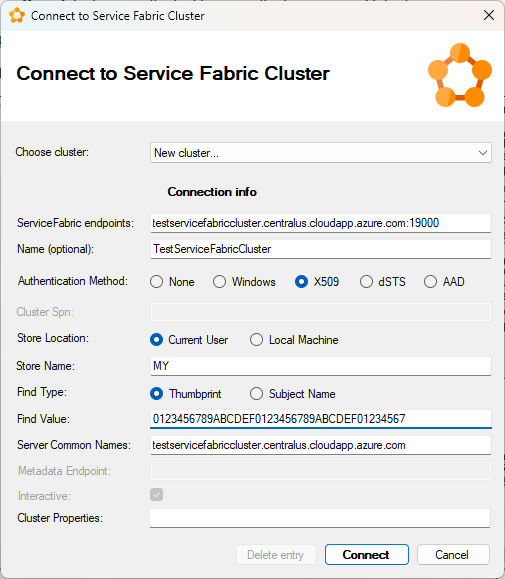

   - **ServiceFabric endpoints**: Enter your cluster endpoint
     - **Must include port 19000**: `https://<clustername>.<region>.cloudapp.azure.com:19000`
     - Example: `testservicefabriccluster.centralus.cloudapp.azure.com:19000`
   - **Name (optional)**: Give the connection a friendly name (e.g., "TestServiceFabricCluster")

3. **Select Authentication Method:**
   - **X509**: Certificate-based authentication (most common)
   - **AAD**: Azure Active Directory
   - **Windows**: Windows authentication
   - **dSTS**: Distributed Security Token Service (Microsoft internal use only)
   - **None**: For unsecured clusters (dev/test only)

4. **For X509 certificate authentication (required fields):**

   > **Important:** Both thumbprint and server common name are required for connection to work.

   - **Store Location**: Typically "Current User" (certificates in `Cert:\CurrentUser\My`)
   - **Store Name**: Always "MY" (Personal certificates store)
   - **Find Type**:
     - **Thumbprint** (most common) - use certificate thumbprint
     - **Subject Name** - use certificate subject/common name
   - **Find Value**: Enter the certificate thumbprint (e.g., `012345678ABCDEF0123456789ABCDEF012345678`)
   - **Server Common Names**: Enter the certificate subject name/common name (e.g., `testservicefabriccluster.centralus.cloudapp.azure.com`)

5. **For self-signed certificates:**

   > **Warning:** Self-signed certificates should **only** be used for development and test environments. Production clusters must use certificates issued by a trusted Certificate Authority (CA). Self-signed certificates do not provide identity verification and are vulnerable to man-in-the-middle attacks.

   If using a self-signed certificate, you must install it in **two locations** on your development/admin machine:

   - **Personal store** (`Cert:\CurrentUser\My`) - for client authentication
   - **Trusted Root Certification Authorities** (`Cert:\CurrentUser\Root`) - to trust the certificate

   **Option A: Install using Certificate Manager (certlm.msc):**

   1. Run `certlm.msc` (Local Machine certificates)
   2. **Import to Personal store:**
      - Right-click **Personal\Certificates** → All Tasks → Import
      - Browse to PFX file, enter password
      - Select "Personal" as destination store
   3. **Add to Trusted Root:**
      - In **Personal\Certificates**, find your certificate
      - Right-click certificate → Copy
      - Navigate to **Trusted Root Certification Authorities\Certificates**
      - Right-click in the list → Paste

        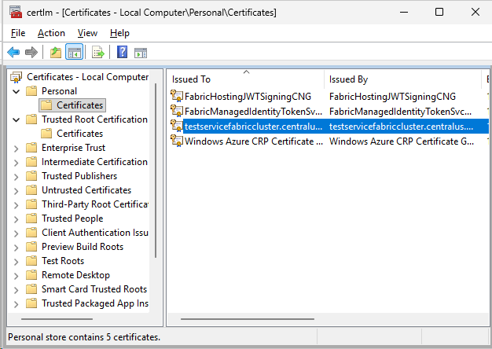

   4. **Verify certificate chain:**
      - Double-click certificate → Certification Path tab
      - Should show "This certificate is OK"

        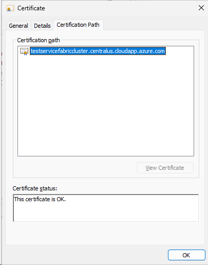

   **Option B: Install using PowerShell:**

   ```powershell
   # Import to Personal store
   Import-PfxCertificate -FilePath "path\to\cert.pfx" -CertStoreLocation Cert:\CurrentUser\My -Password (ConvertTo-SecureString -String "password" -AsPlainText -Force)
   
   # Export public key
   $cert = Get-Item Cert:\CurrentUser\My\<thumbprint>
   Export-Certificate -Cert $cert -FilePath "cert.cer"
   
   # Import to Trusted Root
   Import-Certificate -FilePath "cert.cer" -CertStoreLocation Cert:\CurrentUser\Root
   ```

6. **Click Connect** to establish connection to the cluster

7. **Browse the cluster** - The tree view on the left shows cluster entities, applications, services, and nodes

> **Important:** The desktop application does NOT require the Client Authentication EKU in certificates - it works with certificates that only have Server Authentication EKU.

### Features

Service Fabric Explorer desktop provides full cluster management capabilities:

#### Auto Refresh

The application can automatically refresh cluster data at configurable intervals:

- **Default**: Auto-refresh is disabled (Off)
- **Available intervals**: 1, 2, 5, 10, 30, 60, 300, or 600 seconds
- Configure via the auto-refresh dropdown in the toolbar
- Manual refresh available via refresh button or **F5** key
- Auto-refresh automatically disables after 1 hour to prevent long-running operations

> **Performance Note:** Aggressive auto-refresh intervals (1-5 seconds) can impact cluster performance on large clusters (100+ nodes) by generating frequent health queries. For production clusters, use intervals of 30 seconds or higher, or rely on manual refresh (**F5**).

#### Cluster Overview

  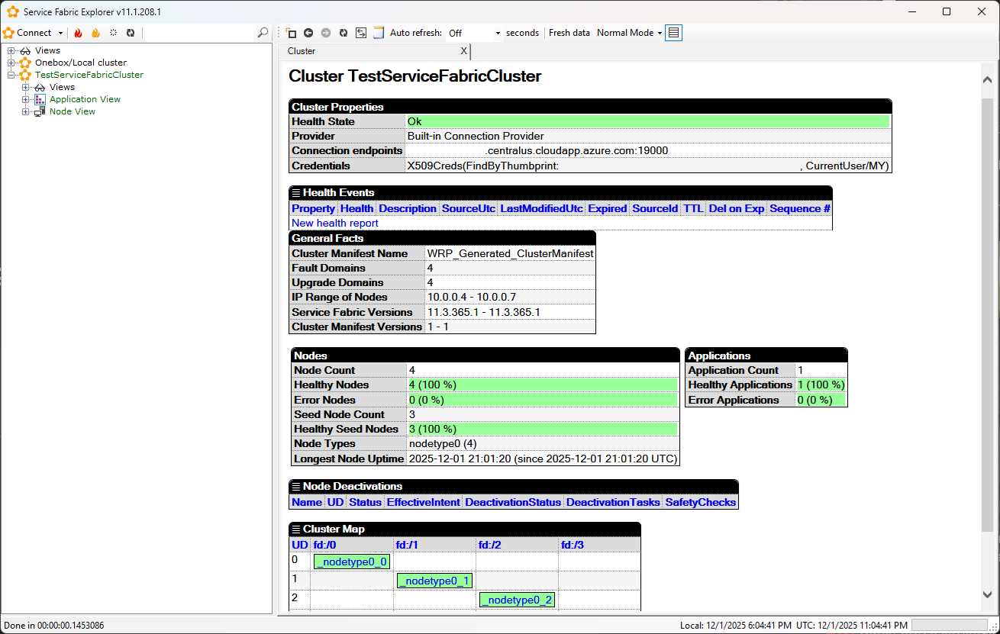

- View cluster health and status
- Monitor cluster properties and connection information
- Check cluster manifest versions and upgrade domains

#### Node Management

  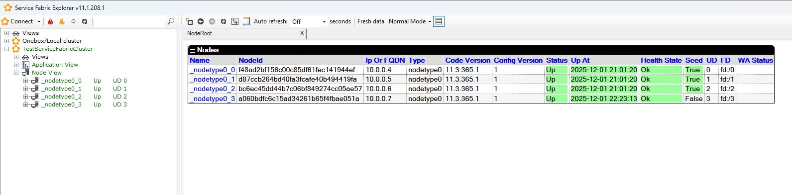

- View all cluster nodes with IP addresses and status
- Right-click nodes for management operations:

  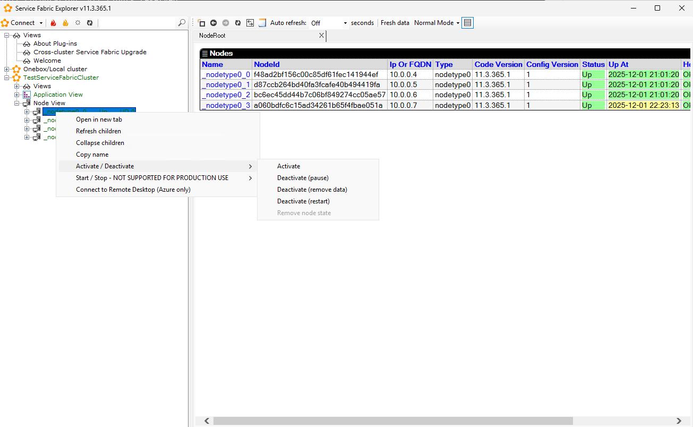

- Activate/Deactivate nodes (pause, remove data, restart)
- Connect to Remote Desktop (Azure only)
- Copy node information

#### Application and Service Management

  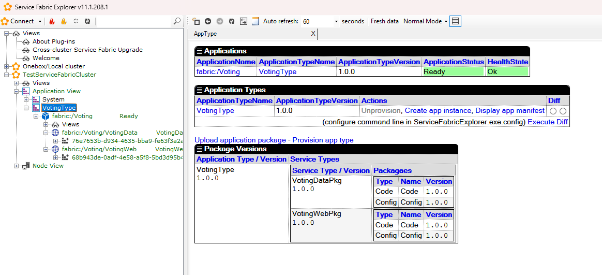

- Browse applications, services, and partitions
- View application health and deployment status

  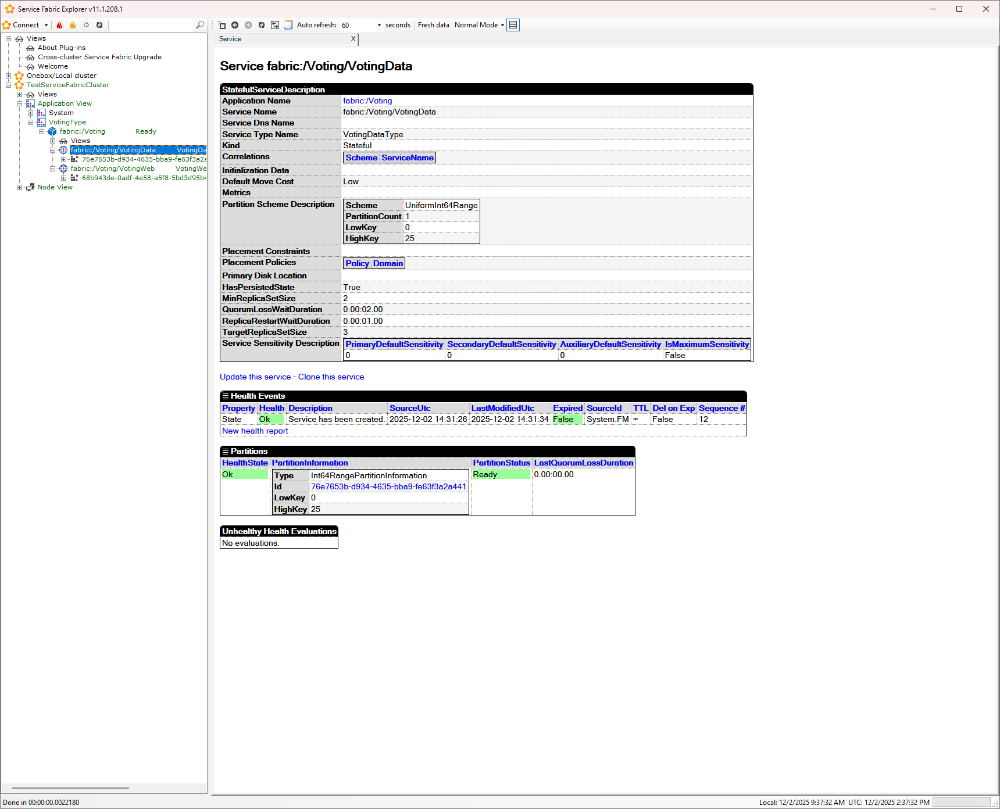

- Monitor service replicas and instances
- Right-click services for management operations:

  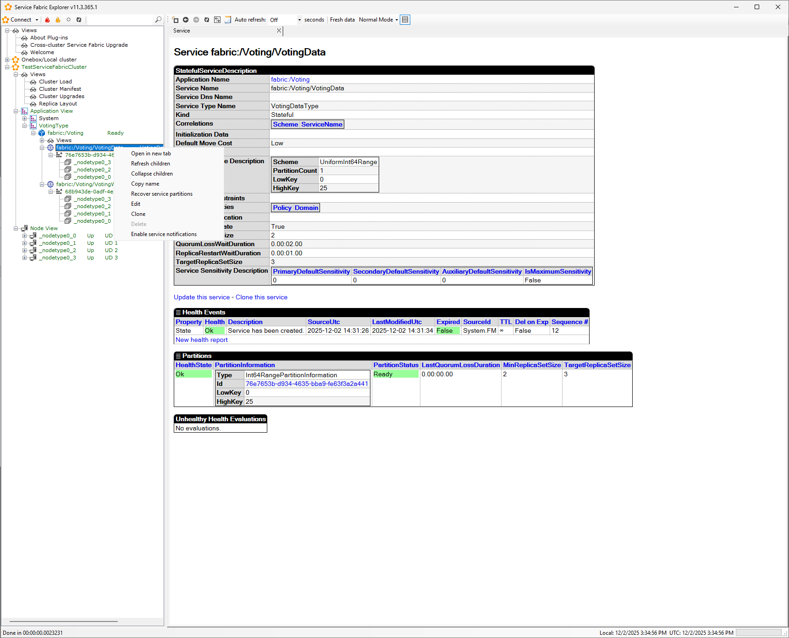

- Update/rollback service configuration
- Clone service
- Evaluate service policies
- Refresh service children

  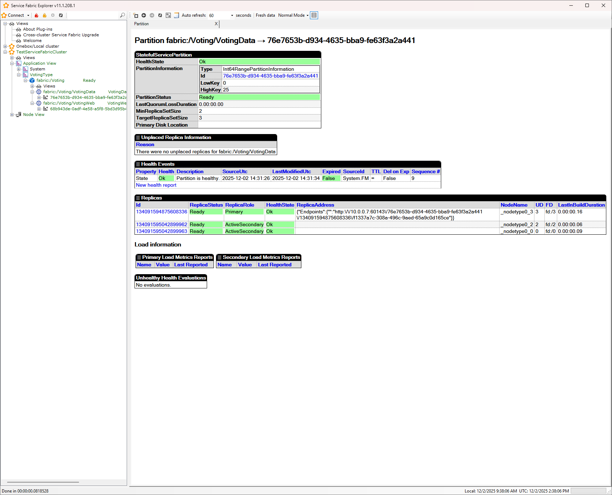

- View replica and instance details including health status and address information
- Right-click partitions for management operations:

  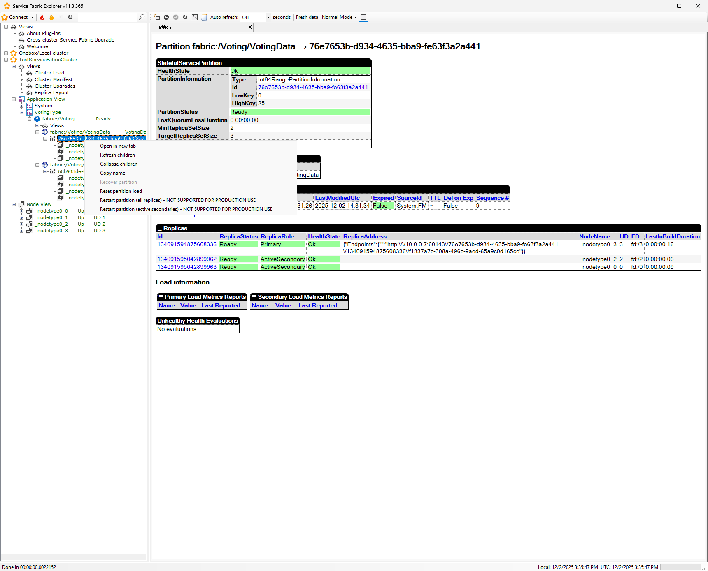

- Reset partition load
- Restart partition (all replicas - NOT SUPPORTED FOR PRODUCTION USE)
- Recover partition (requires Power Mode)

  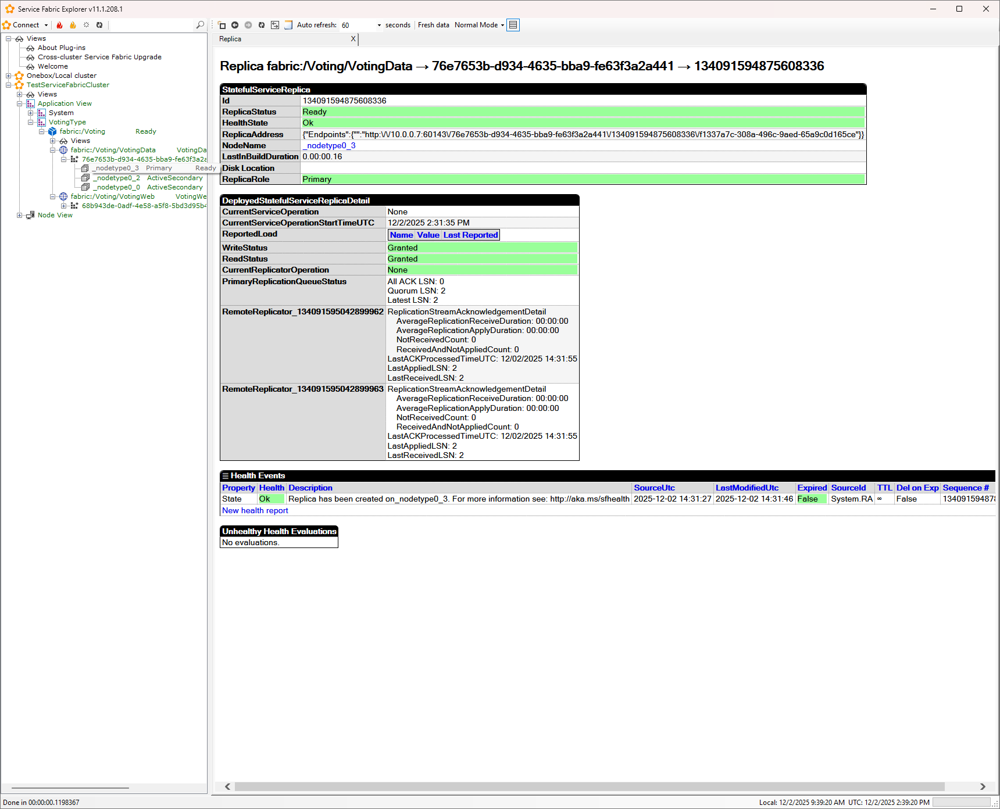

- Check upgrade progress and history
- Right-click replicas for management operations:

  

- Open in new tab
- Collapse children
- Copy name
- Restart replica
- Remove replica (requires Power Mode)
- Move replica
- Connect to Remote Desktop (Azure only)

#### System Services

  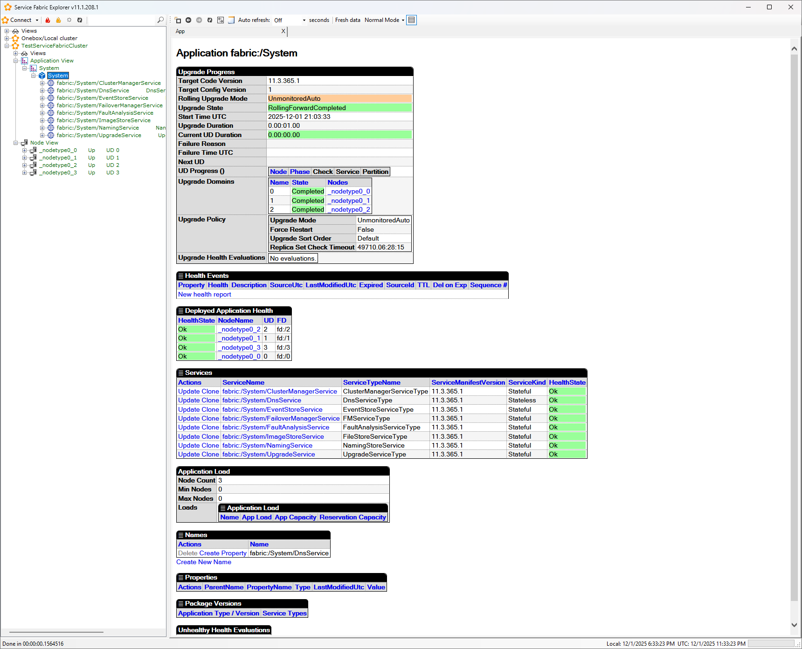

- View and monitor Service Fabric system services
- Check system service health and status

#### Cluster Monitoring

##### Cluster Load

  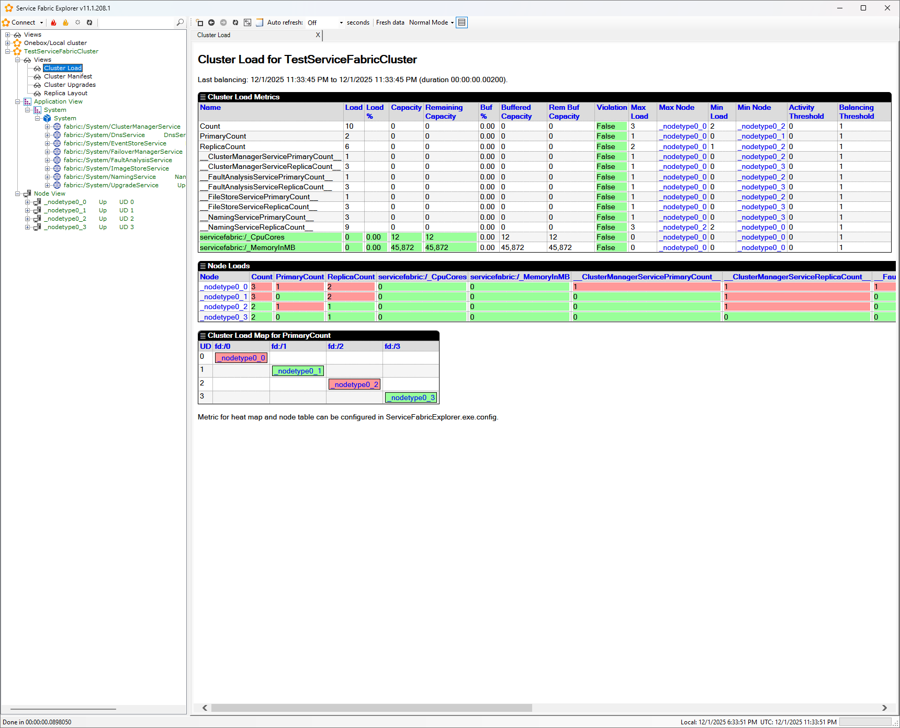

- Monitor cluster load and resource utilization
- View load distribution across nodes
- Track metrics for capacity planning

##### Cluster Upgrades

  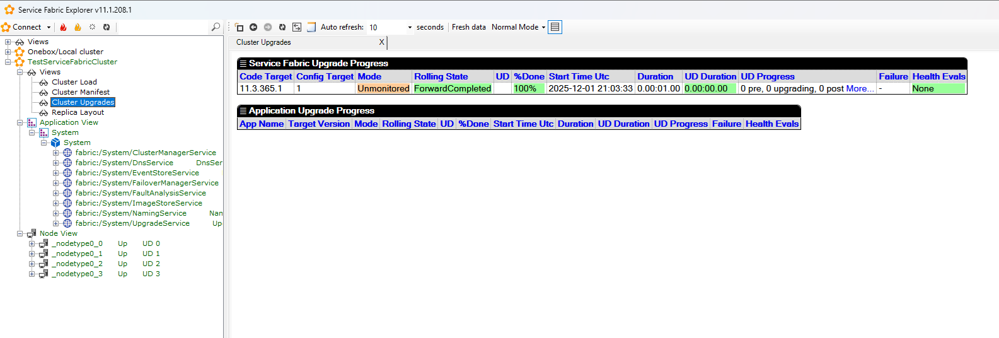

- View cluster and application upgrade progress
- Monitor upgrade status and health

##### Replica Layout

  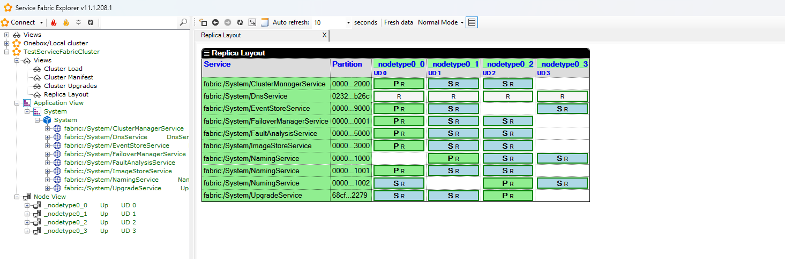

- Visualize replica distribution across nodes
- Identify primary and secondary replicas for each partition

### Operation Modes

Service Fabric Explorer desktop has two operation modes:

- **Normal Mode** (default): Read-only operations and safe actions like activating/deactivating nodes
- **Power Mode**: Enables potentially harmful operations that can impact cluster state

**Power Mode is required for:**

- Unprovisioning application types
- Unprovisioning Service Fabric code and config versions
- Deleting names and properties
- Partition recovery operations (recover partition, recover partitions, recover system partitions)
- Removing node state

> **Warning:** Use Power Mode with extreme caution. Operations in Power Mode can cause:
> 
> - **Data loss**: Removing replicas or node state can delete application data permanently
> - **Quorum loss**: Removing too many replicas can break quorum, making partitions unavailable
> - **Cluster instability**: Unprovisioning active application types can disrupt running services
> - **Recovery complications**: Some operations cannot be reversed without cluster rebuild
> 
> Always verify operations in a non-production environment first. Never use Power Mode on production clusters without explicit approval and change management procedures.

To enable Power Mode, select **Power** from the mode dropdown in the toolbar (default is **Normal** mode).

### Keyboard Shortcuts

- **F5** - Refresh current node and browser pane
- **Ctrl + Tab** - Switch to next tab
- **Ctrl + Shift + Tab** - Switch to previous tab
- **Ctrl + W** - Close current tab
- **Ctrl + R** - Refresh browser pane
- **Ctrl + F** - Focus on search box

### Search Functionality

The search box in the toolbar allows quick navigation to cluster entities:

- Search by: cluster name, application name, service name, partition ID, node name, node ID, IP/FQDN, or node instance ID
- Search is case-insensitive
- Auto-expands tree view to found items
- Press **Enter** or click search button to execute

### Authentication Methods

The desktop application supports multiple authentication methods:

- **None** - For unsecured clusters (dev/test only)
- **Windows** - Windows authentication (on-premises clusters)
- **X509** - Certificate-based authentication (does not require Client Authentication EKU)
- **dSTS** - Distributed Security Token Service (Microsoft internal use only)
- **AAD** - Azure Active Directory ([setup guide](https://learn.microsoft.com/en-us/azure/service-fabric/service-fabric-cluster-creation-setup-azure-ad-via-portal))

### Command-Line Usage

You can specify a previously saved cluster connection by name to auto-select it on launch:

**Syntax:**

```powershell
ServiceFabricExplorer.exe "<cluster-name>"
```

**Example:**

```powershell
# Select a previously saved cluster connection named "Production"
ServiceFabricExplorer.exe "Production"
```

> **Important:** The command-line argument only accepts a **saved cluster name**, not an endpoint or URL. The cluster must have been previously connected and saved in Service Fabric Explorer. To connect to a new cluster, launch the application without parameters and use the Connect dialog.

### Multi-Tab Support

- Open entities in new tabs via context menu
- Navigate between tabs with **Ctrl + Tab** / **Ctrl + Shift + Tab**
- Close tabs with **Ctrl + W** (cannot close last tab)

### Telemetry

The application collects usage telemetry by default. To disable:

1. Close Service Fabric Explorer
2. Edit `ServiceFabricExplorer.exe.config` in the installation directory:
   - Path: `C:\Program Files\Microsoft SDKs\Service Fabric\Tools\ServiceFabricExplorer\ServiceFabricExplorer.exe.config`
3. Locate the `EnableTelemetry` setting and change to `false`:

   ```xml
   <appSettings>
     <add key="EnableTelemetry" value="false" />
   </appSettings>
   ```

4. Save the file and restart the application

## Troubleshooting

### Cannot Find ServiceFabricExplorer.exe

**Solution:**

- Verify Service Fabric SDK is installed: Check `Programs and Features`
- Check installation path: `C:\Program Files\Microsoft SDKs\Service Fabric\Tools\ServiceFabricExplorer\`
- Reinstall Service Fabric SDK if missing

### Certificate Not Appearing in Selection Dialog

**Check:**

- Certificate is installed in correct store: `Cert:\CurrentUser\My` or `Cert:\LocalMachine\My`
- Certificate has private key
- Certificate common name or thumbprint matches cluster configuration
- Certificate is not expired

### Connection Failures

**Verify:**

- Cluster endpoint is correct with port (format: `clustername:19000`)
  - Desktop app uses management endpoint port **19000**
  - Browser-based SFX uses HTTP gateway port **19080**
- Network connectivity to cluster
- Certificate has proper permissions (admin or read-only user configured in cluster)
- Certificate chains to a trusted root CA
- For X509/dSTS authentication, server common names are required

**Common Error Codes:**

- **FABRIC_E_CERTIFICATE_NOT_FOUND**: Certificate not found in specified store location
  - Verify certificate is in `Cert:\CurrentUser\My` or `Cert:\LocalMachine\My`
  - Check thumbprint is correct (64 hex characters, no spaces)
- **FABRIC_E_SERVER_AUTHENTICATION_FAILED**: Server certificate validation failed
  - Ensure server common name matches cluster certificate CN
  - Verify certificate chains to trusted root CA
  - For self-signed certs, install in `Trusted Root Certification Authorities`
- **FABRIC_E_TIMEOUT**: Connection timeout
  - Check network connectivity to cluster endpoint
  - Verify port 19000 is not blocked by firewall
  - Confirm cluster is running and healthy
- **UnauthorizedAccessException**: Certificate lacks required permissions
  - Verify certificate is configured as admin or read-only client in cluster settings
  - Use `Add-AzServiceFabricClientCertificate` to register certificate

### Minimum Service Fabric Version

**Requirement:**

- Service Fabric version **6.0.0.0** or later
- The application will prompt to upgrade if an older version is detected
- Check cluster version: Connect to cluster → Cluster node → Essential metrics shows Service Fabric version
- [Service Fabric release notes and version support](https://learn.microsoft.com/en-us/azure/service-fabric/service-fabric-versions)

## Comparison: Desktop vs Browser-Based SFX

| Feature | Desktop SFE | Browser SFX |
|---------|-------------|-------------|
| **Port** | 19000 (Management) | 19080 (HTTP Gateway) |
| **Client Auth EKU Required** | ❌ No | ✅ Yes |
| **Platform** | Windows only | Cross-platform (Windows, Linux, macOS) |
| **Certificate Store** | Native Windows API | Browser certificate dialog |
| **Installation** | Requires Service Fabric SDK | No installation (web-based) |
| **Auto-refresh** | Configurable intervals | Manual or auto-refresh |
| **Power Mode** | Available | Not available |
| **Authentication** | X509, AAD, Windows, None | X509, AAD |
| **Multi-tab Support** | ✅ Yes | ✅ Yes |
| **Network Requirements** | TCP 19000 | HTTPS 19080 |
| **Certificate Restrictions** | Server Auth EKU sufficient | Requires Client Auth EKU |
| **Best For** | Admin/dev machines, EKU-limited certs | Quick access, any OS |

## Advantages Over Browser-Based SFX

- **Works with any certificate**: No Client Authentication EKU requirement
- **Standalone application**: No browser security restrictions
- **Consistent experience**: Not affected by browser certificate handling changes
- **Direct certificate store access**: Uses Windows certificate store natively
- **Power Mode operations**: Enables advanced cluster management tasks

## Additional Resources

- [Service Fabric SDK setup](https://learn.microsoft.com/en-us/azure/service-fabric/service-fabric-get-started)
- [Visualize your cluster with Service Fabric Explorer](https://learn.microsoft.com/en-us/azure/service-fabric/service-fabric-visualizing-your-cluster)
- [Service Fabric versions and support](https://learn.microsoft.com/en-us/azure/service-fabric/service-fabric-versions)
- [Azure AD authentication setup](https://learn.microsoft.com/en-us/azure/service-fabric/service-fabric-cluster-creation-setup-azure-ad-via-portal)
- [Service Fabric cluster security scenarios](https://learn.microsoft.com/en-us/azure/service-fabric/service-fabric-cluster-security)
- [Certificate Client Authentication EKU Removal Impact](certificate-client-authentication-eku-removal-impact.md)
